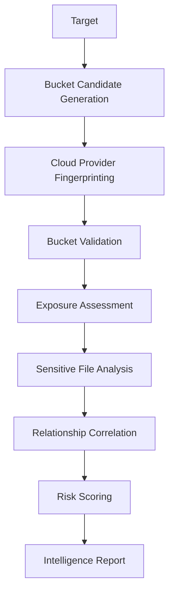

# CloudRift

**CloudRift** is a modern cloud storage exposure intelligence framework for authorized security research, cloud attack surface mapping, bug bounty reconnaissance, academic demonstrations, and defensive validation of cloud storage configurations.

It is built as an intelligence pipeline rather than a simple bucket brute-forcer: CloudRift generates realistic storage candidates, extracts JavaScript and source map references, fingerprints cloud providers, validates exposure states asynchronously, detects sensitive object names, correlates relationships, and renders clean risk-based reports.

> Built by Arghya Sikdar

## Preview

```text
┌──────────────────────────────────────────────┐
│ CloudRift                                    │
│ Cloud Storage Exposure Intelligence          │
│ Built by Arghya Sikdar                       │
└──────────────────────────────────────────────┘

HIGH RISK
  target-backups
  database.sql exposed
  .env publicly accessible

MEDIUM RISK
  open object listing
  public development assets

RELATIONSHIPS
  target.com
   ├── target-assets
   ├── target-backups
   └── staging-target
```

## Architecture



## Features

- Async-first Python 3.12 engine
- AWS S3, Google Cloud Storage, Azure Blob Storage, Firebase Storage, DigitalOcean Spaces, and Cloudflare R2 adapters
- Realistic bucket naming heuristics using AWS-compatible naming constraints
- JavaScript and source map storage reference extraction
- Provider fingerprinting for common storage endpoints
- Public access, listability, existence, and access denied behavior analysis
- Sensitive object detection for `.env`, database dumps, backups, keys, logs, CI/CD artifacts, and Terraform state
- Relationship mapping between targets, frontend artifacts, and discovered storage assets
- Confidence scoring, deduplication, and risk grouping
- Rich terminal UI and JSON export
- Docker and pytest support

## Installation

```bash
python3.12 -m venv .venv
source .venv/bin/activate
pip install -e .
```

## Usage

```bash
cloudrift target.com
cloudrift target.com --provider aws --threads 50 --timeout 6
cloudrift target.com --js-analysis --sourcemaps
cloudrift target.com --json --output findings.json
cloudrift target.com --passive-only
```

### CLI Flags

```text
--json
--output findings.json
--provider aws
--wordlist custom.txt
--threads 50
--timeout 6
--proxy http://127.0.0.1:8080
--verbose
--js-analysis
--sourcemaps
```

## Provider Support Matrix

| Provider | Endpoint detection | Validation | Listing analysis | Sensitive object analysis |
|---|---:|---:|---:|---:|
| AWS S3 | Yes | Yes | Yes | Yes |
| Google Cloud Storage | Yes | Yes | Yes | Yes |
| Azure Blob Storage | Yes | Yes | Yes | Yes |
| Firebase Storage | Yes | Yes | Partial | Yes |
| DigitalOcean Spaces | Yes | Yes | Yes | Yes |
| Cloudflare R2 | Yes | Yes | Yes | Yes |

## Docker

```bash
docker compose up
```

Override the default target:

```bash
docker compose run --rm cloudrift target.com --passive-only
```

## Development

```bash
pip install -e ".[dev]"
pytest
```

## Ethical Usage

CloudRift is intended strictly for authorized assessments, legitimate cybersecurity research, academic use, and defensive security validation. Only assess assets you own or have explicit permission to test. Public exposure findings can include sensitive information; handle reports responsibly and follow applicable disclosure policies.

## Roadmap

- Signed URL leak analysis
- Additional provider-specific policy checks
- Historical passive DNS and certificate transparency enrichment
- SARIF export
- HTML report renderer
- Pluggable enterprise asset inventory integrations
