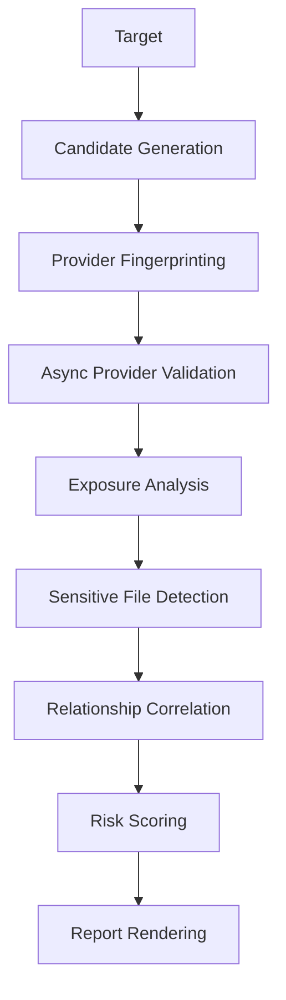

# CloudRift Architecture

CloudRift is organized as a staged intelligence pipeline:

Provider support is implemented behind `CloudStorageProvider`, making new providers a small adapter rather than a rewrite.
